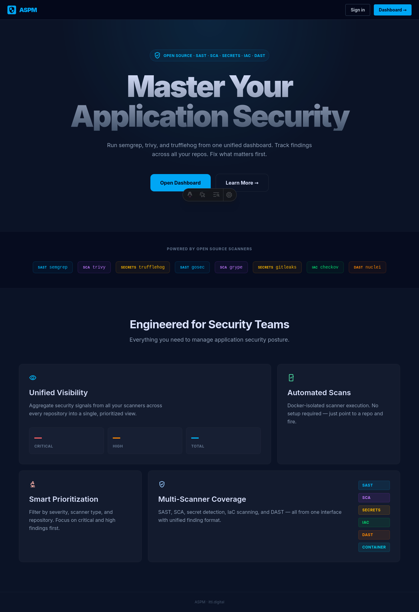
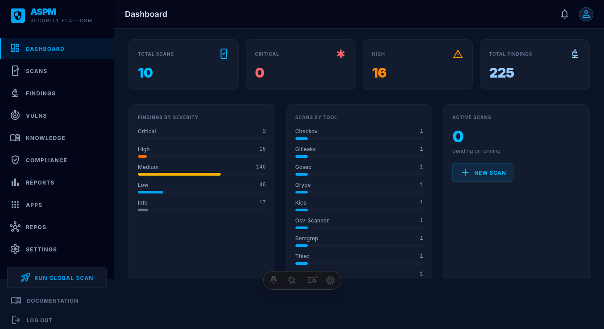
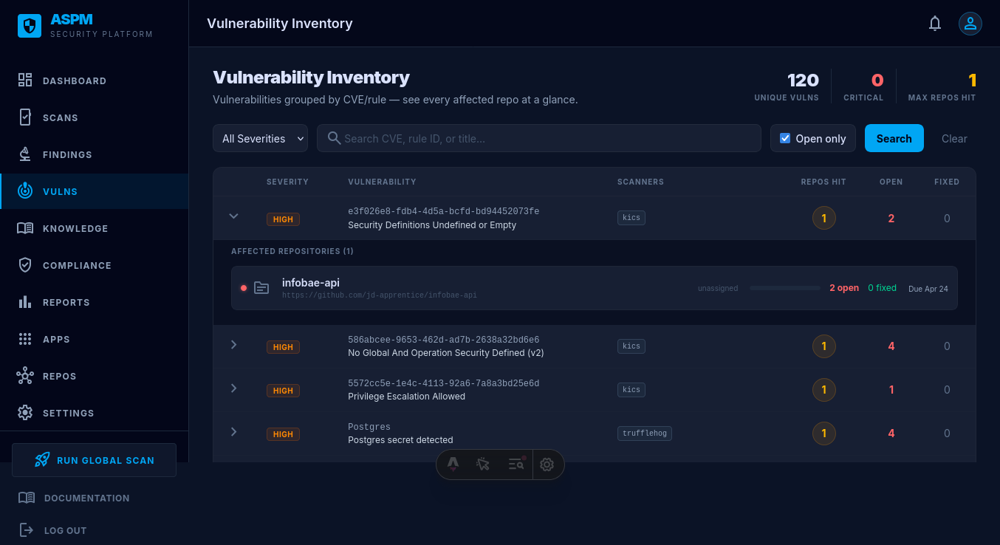
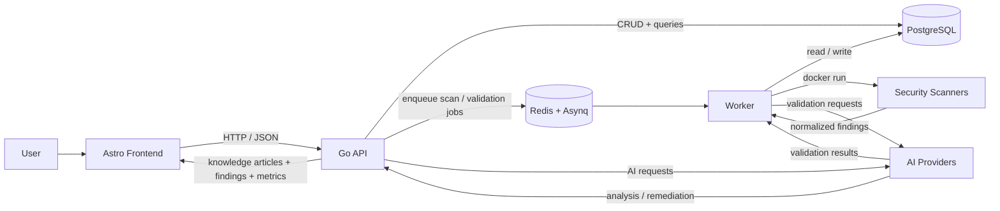
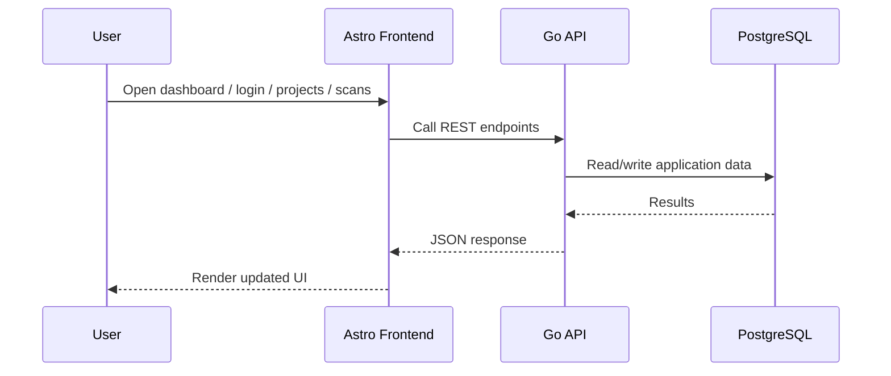
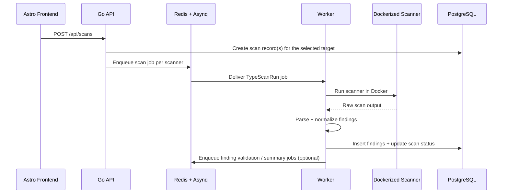
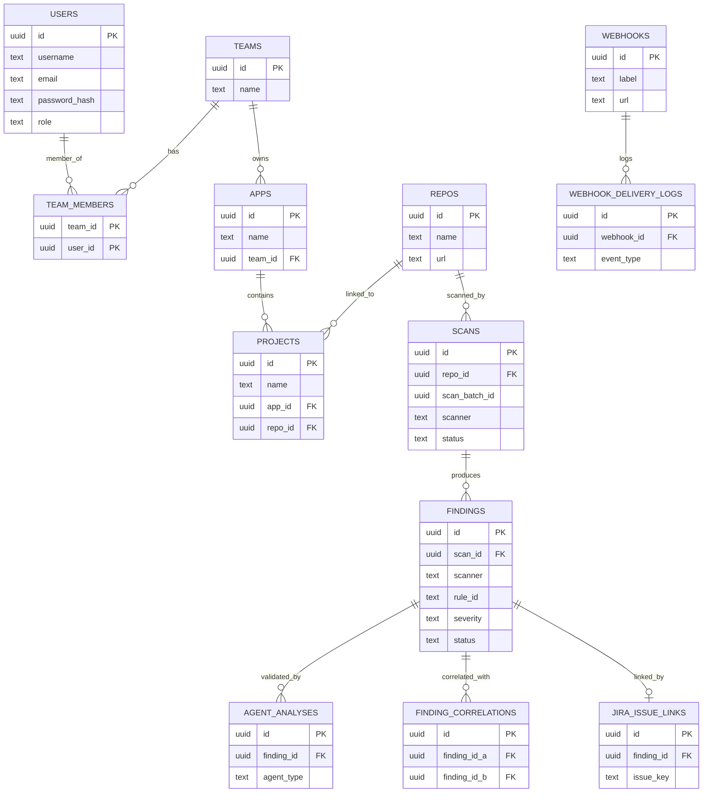

# HenKaiPan


HenKaiPan is an ASPM (Application Security Posture Management) platform that centralizes security scans, findings management, vulnerability intelligence, knowledge articles, policy automation, and AI-assisted remediation.

## Screenshots

### Landing



### Dashboard



### Vulns



## Product Model

- **App** = optional business grouping
- **Project** = primary technical unit that users create, connect, scan, and review
- **Standalone projects** are allowed (`project.app_id = NULL`)
- **Repository connections** are managed as reusable records (`repos`) that projects can reference

## Platform Features

1. **Dashboard** — metrics cards, severity bars, scanner bars, recent scans
2. **Scans** — scanner type badges, status dots, execution logs, findings table
3. **Findings** — severity/scanner filters, status filters, SLA tracking, triage modal
4. **Vulns** — vulnerability inventory grouped by CVE/rule_id with affected assets
5. **Knowledge** — remediation guides, AI-generated articles, CWE/rule lookup
6. **Compliance** — SOC2/ISO 27001/PCI-DSS frameworks, control mapping
7. **Reports** — SLA compliance, trends chart, risk scores, CSV export
8. **Apps** — optional business grouping for projects
9. **Projects** — primary technical unit for scanning
10. **Settings** — General, Integrations, Notifications, Security, Policies, Users, Teams

## Tech Stack

- **Frontend:** Astro 6 + Tailwind v4
- **API:** Go + chi
- **Database:** PostgreSQL 17 + pgx v5
- **Background jobs:** Redis 8 + Asynq
- **Scanners:** Dockerized tools (Semgrep, Trivy, Gitleaks, Checkov, Nuclei, and more)
- **AI features:** OpenRouter and Cloudflare Workers AI for remediation generation and finding validation

## Architecture Overview

HenKaiPan is split into three main runtime layers:

- **Frontend (`/frontend`)**: renders the UI and calls the backend API.
- **API (`/cmd/api`)**: exposes REST endpoints, authenticates users, reads/writes data, and enqueues async work.
- **Worker (`/cmd/worker`)**: consumes queued jobs, runs scanners in Docker containers, parses results, stores findings, and triggers AI validation.

PostgreSQL stores the platform state, while Redis/Asynq is used as the job queue between the API and the worker.

## High-Level Architecture Diagram



## Runtime Flow

### 1. User-facing request flow



### 2. Scan execution flow



### 3. AI remediation and validation flow


## Main Components

### Frontend

- Built with Astro 6 and Tailwind v4.
- Uses `frontend/src/lib/api.ts` as the browser-side API client.
- Provides:
  - Landing page with scanner showcase and feature bento grid
  - Login page with JWT auth via HttpOnly cookie
  - Dashboard with metrics, severity bars, scanner bars, recent scans
  - Scans page with scanner type badges and status indicators
  - Findings page with filters, SLA tracking, and triage modal
  - Vulns page with vulnerability inventory
  - Knowledge center with remediation guides
  - Compliance page with framework mapping
  - Reports page with trends and exports
  - Apps and Projects management
  - Settings with tabs for General, Integrations, Notifications, Security, Policies, Users, Teams

### API

- Entry point: `cmd/api/main.go`
- Responsibilities:
  - JWT authentication via HttpOnly cookie and role-based authorization (admin/analyst/viewer)
  - REST endpoints for:
    - Authentication (`/api/auth`)
    - Users (`/api/users`)
    - Teams (`/api/teams`)
    - Apps (`/api/apps`)
    - Projects (nested under `/api/apps/{id}/projects`)
    - Repositories (`/api/repos`)
    - Scans (`/api/scans`)
    - Findings (`/api/findings`)
    - Vulnerabilities (`/api/vulnerabilities`)
    - Knowledge (`/api/knowledge`)
    - Policies (`/api/policies`)
    - Suppressions (`/api/suppressions`)
    - Scanners (`/api/scanners`)
    - Webhooks (`/api/webhooks`)
    - Settings (`/api/settings`)
    - Metrics (`/api/metrics`)
  - Metrics and export endpoints
  - Enqueueing asynchronous scan, validation, summary, webhook, and email jobs
  - AI remediation endpoint (`/api/knowledge/ai-remediate`)

### Worker

- Entry point: `cmd/worker/main.go`
- Responsibilities:
  - Consume Asynq jobs from Redis
  - Recover stuck scans on boot
  - Process `scan:run` jobs tied to a target + scanner
  - Process `agent:validate` jobs when AI is configured
  - Process `agent:summarize` jobs for AI summaries
  - Process `webhook:deliver` jobs for event delivery
  - Process `email:send` jobs for notifications

### Scanning Engine

- Scanner registry: `internal/scanner/registry.go`
- Execution pipeline: `internal/tasks/scan_run.go`
- Supports multiple categories:
  - **SAST:** Semgrep, Gosec
  - **SCA:** Trivy, Grype, OSV-Scanner
  - **Secrets:** TruffleHog, Gitleaks
  - **IaC:** Checkov, tfsec, KICS
  - **Containers:** Trivy Image, Grype Image
  - **DAST:** Nuclei

All scanners are executed as Docker containers so the worker stays generic and scanner-specific behavior is defined by the registry.

### Data Layer

- PostgreSQL is the system of record.
- DB connection setup lives in `internal/db/postgres.go`.
- Repository layer lives under `internal/repository`.
- Models live under `internal/models`.
- Migrations live in `/migrations` and are auto-run by Docker on container initialization.

### Database Schema (DBML)

```dbml
Table users {
  id uuid [pk]
  username text [not null, unique]
  email text [not null, unique]
  password_hash text [not null]
  role text [not null, default: 'analyst']
  created_at timestamptz
  last_login timestamptz
}

Table teams {
  id uuid [pk]
  name text [not null, unique]
  created_at timestamptz
}

Table team_members {
  team_id uuid [pk, not null]
  user_id uuid [pk, not null]
}

Table apps {
  id uuid [pk]
  name text [not null, unique]
  description text [not null, default: '']
  team_id uuid
  created_at timestamptz
  updated_at timestamptz
}

Table repos {
  id uuid [pk]
  name varchar(255) [not null]
  url text [not null, unique]
  created_at timestamptz
  updated_at timestamptz
}

Table projects {
  id uuid [pk]
  name text [not null]
  description text [not null, default: '']
  app_id uuid [not null]
  repo_id uuid
  created_at timestamptz
  updated_at timestamptz
}

Table scans {
  id uuid [pk]
  repo_id uuid
  scan_batch_id uuid [not null]
  scanner varchar(50) [not null]
  status varchar(20) [not null, default: 'pending']
  target text [not null]
  started_at timestamptz
  completed_at timestamptz
  created_at timestamptz
  error text
  container_log text
}

Table findings {
  id uuid [pk]
  scan_id uuid [not null]
  scanner varchar(50) [not null]
  rule_id varchar(255)
  cve_id text
  cwe_id text
  title text [not null]
  description text
  severity varchar(20) [not null, default: 'info']
  file_path text
  line_start int
  line_end int
  code_snippet text
  raw jsonb
  status varchar(20) [not null, default: 'open']
  assigned_to text
  false_positive boolean [not null, default: false]
  notes text
  resolved_at timestamptz
  sla_deadline timestamptz
  remediation_slug text
  confidence_score float
  corroboration_count int [not null, default: 0]
  suppressed boolean [not null, default: false]
  ai_summary text
  summary_fingerprint text
  summary_state text [not null, default: 'none']
  sla_breach_attempted_at timestamptz
  created_at timestamptz
}

Table agent_analyses {
  id uuid [pk]
  finding_id uuid [not null]
  agent_type text [not null, default: 'validator']
  confidence float [not null, default: 0]
  fp_likelihood text [not null, default: 'unknown']
  reasoning text
  raw_output jsonb
  created_at timestamptz
  updated_at timestamptz
}

Table finding_correlations {
  id uuid [pk]
  finding_id_a uuid [not null]
  finding_id_b uuid [not null]
  correlation_type text [not null, default: 'same_location']
  created_at timestamptz
}

Table finding_summary_cache {
  fingerprint text [pk]
  scanner text [not null]
  rule_id text [not null]
  title text [not null]
  issue_type text
  status text [not null, default: 'pending']
  summary text
  created_at timestamptz
  updated_at timestamptz
}

Table knowledge_articles {
  id uuid [pk]
  slug text [not null, unique]
  title text [not null]
  content_md text [not null]
  tags text[] [not null]
  cwe_ids text[] [not null]
  rule_ids text[] [not null]
  scanner text [not null, default: '']
  auto_generated boolean [not null, default: false]
  created_at timestamptz
  updated_at timestamptz
}

Table policies {
  id uuid [pk]
  name text [not null]
  conditions jsonb [not null]
  actions jsonb [not null]
  enabled boolean [not null, default: true]
  created_at timestamptz
}

Table suppressions {
  id uuid [pk]
  name text [not null]
  rule_id text
  file_pattern text
  scanner text
  reason text
  created_at timestamptz
}

Table webhooks {
  id uuid [pk]
  label text [not null]
  url text [not null]
  events jsonb [not null]
  enabled boolean [not null, default: true]
  last_delivery timestamptz
  delivery_count int [not null, default: 0]
  error_count int [not null, default: 0]
  last_error text
  delivery_type text [not null, default: 'generic']
  created_at timestamptz
}

Table webhook_delivery_logs {
  id uuid [pk]
  webhook_id uuid [not null]
  event_type text [not null]
  payload jsonb [not null]
  status_code int
  response_body text
  error_message text
  created_at timestamptz
}

Table notification_settings {
  singleton boolean [pk, not null, default: true]
  alert_critical boolean [not null, default: true]
  alert_high boolean [not null, default: false]
  alert_scan_complete boolean [not null, default: true]
  alert_scan_failed boolean [not null, default: true]
  alert_sla_breach boolean [not null, default: true]
  email_recipients jsonb [not null]
  created_at timestamptz
  updated_at timestamptz
}

Table jira_integrations {
  singleton boolean [pk, not null, default: true]
  base_url text [not null, default: '']
  user_email text [not null, default: '']
  project_key text [not null, default: '']
  issue_type text [not null, default: 'Task']
  labels jsonb [not null]
  token text [not null, default: '']
  enabled boolean [not null, default: false]
  created_at timestamptz
  updated_at timestamptz
}

Table jira_issue_links {
  id uuid [pk]
  finding_id uuid [not null, unique]
  issue_key text
  issue_url text
  status text
  created_at timestamptz
}

Ref: team_members.team_id > teams.id
Ref: team_members.user_id > users.id
Ref: apps.team_id > teams.id
Ref: projects.app_id > apps.id
Ref: projects.repo_id > repos.id
Ref: scans.repo_id > repos.id
Ref: findings.scan_id > scans.id
Ref: agent_analyses.finding_id > findings.id
Ref: finding_correlations.finding_id_a > findings.id
Ref: finding_correlations.finding_id_b > findings.id
Ref: webhook_delivery_logs.webhook_id > webhooks.id
Ref: jira_issue_links.finding_id > findings.id
```

> Note: sensitive persisted integration secrets (for example the Jira token) are encrypted at rest; user passwords remain hashed.

### Core Schema Diagram (Mermaid)



> Mermaid is intentionally simplified; the DBML block above is the full schema reference.

### Queue Layer

- Redis is used by Asynq for background job transport.
- Queue bootstrap lives in `internal/queue/queue.go`.
- The API enqueues work; the worker consumes it.

### AI Layer

- Multiple AI providers supported:
  - `internal/ai/openrouter.go` — OpenRouter integration
  - `internal/ai/cloudflare.go` — Cloudflare Workers AI integration
  - `internal/ai/provider.go` — Provider abstraction layer
  - `internal/ai/notification.go` — AI-powered notification summaries
- AI is used for:
  - **Remediation generation** into knowledge articles
  - **Finding validation** to estimate confidence and false-positive likelihood
  - **Finding summaries** for repeated scanner results
  - **Notification summaries** for human-readable alerts

### Integrations

- **GitHub Integration** (`internal/github/client.go`):
  - GitHub App installation per org/repo
  - Receive PR/webhook context
  - Map scans to PRs
  - Comment on PR with findings summary

- **Jira Integration** (`internal/jira/client.go`):
  - Create tickets from findings
  - Link findings to Jira issues

- **Webhook System** (`internal/webhook/dispatcher.go`):
  - Custom webhook endpoints
  - Event delivery with retries
  - Configurable events (new findings, SLA breaches, etc.)

- **Notifications**:
  - Slack webhook integration
  - Email notifications via SMTP
  - Configurable notification rules

### Findings + Knowledge Modules

- `internal/findings/validation_agent.go` — AI validation flow for findings
- `internal/findings/summary_agent.go` — AI summary generation for findings
- `internal/findings/summarymeta/metadata.go` — summary fingerprint and metadata helpers
- `internal/knowledge/articles.go` — article helpers, slug generation, and remediation article drafting

## Source Tree

```text
cmd/
  api/            # Go API entrypoint
  worker/         # Go worker entrypoint

frontend/
  src/
    pages/       # Astro pages (dashboard, login, etc.)
    layouts/     # Astro layouts
    lib/         # API client and utilities
    styles/      # Tailwind styles

internal/
  ai/            # AI providers (openrouter, cloudflare, notification)
  auth/          # JWT middleware and auth helpers
  config/        # Configuration management
  db/            # PostgreSQL connection bootstrap
  findings/      # Finding validation/summary logic
  github/        # GitHub App integration
  handlers/      # HTTP handlers split by domain/responsibility
  jira/          # Jira integration
  knowledge/     # Knowledge/article helpers
  logger/        # Logging utilities
  middleware/    # HTTP middleware
  models/        # Data models
  queue/         # Redis/Asynq bootstrap
  repository/    # PostgreSQL access layer
  scanner/      # Scanner registry + parsers
  tasks/         # Queue payloads + Asynq handlers
  webhook/      # Webhook dispatcher

migrations/     # PostgreSQL schema and changes
assets/         # Static assets (images, etc.)
```

### Notable Go Files

```text
internal/handlers/
  applications.go          # App CRUD endpoints
  projects.go              # Project CRUD endpoints
  repositories.go          # Repository connection endpoints
  scans.go                 # Scan endpoints
  findings.go              # Findings list/update/export endpoints
  finding_analysis.go      # Finding validation/correlation endpoints
  finding_view.go          # Finding code-context/view helpers
  knowledge_articles.go    # Knowledge article CRUD/list endpoints
  knowledge_remediation.go # AI remediation + article lookup endpoints

internal/repository/
  applications.go          # App persistence
  projects.go              # Project persistence
  repositories.go          # Repo persistence
  finding.go               # Finding persistence
  finding_analysis.go      # Finding analysis/correlation persistence
  knowledge.go             # Knowledge article persistence
  vulnerabilities.go       # Vulnerability persistence

internal/tasks/
  queue_types.go           # Queue task constants + payloads
  scan_run.go              # Main scan execution pipeline
  finding_validate.go      # Finding validation worker handler
  finding_summarize.go     # Finding summary worker handler
  webhook.go               # Webhook delivery jobs
  email.go                 # Email notification jobs
```

## Local Development

### Prerequisites

- Go 1.26+
- Node.js 24+
- PostgreSQL 17+
- Redis 8+
- Docker (for running scanners)

### Start infrastructure only

```bash
make dev-infra
```

### Start each service in separate terminals

```bash
make dev-api
make dev-worker
make dev-frontend
```

### Start the full stack with Docker Compose

```bash
make up
```

## Environment

Copy `.env.example` to `.env` and configure the required variables. All available configuration options are documented in the `.env.example` file, including:

- **Required**: Database, JWT secret, admin credentials
- **Server**: Port, Redis configuration
- **Integrations**: GitHub, SMTP/email
- **AI**: OpenRouter and/or Cloudflare Workers AI configuration

If AI providers are not configured, AI remediation and validation features will be disabled.

## License

MIT
