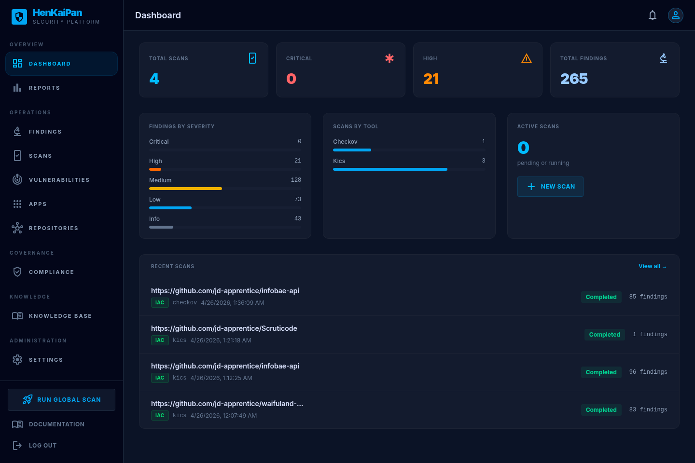
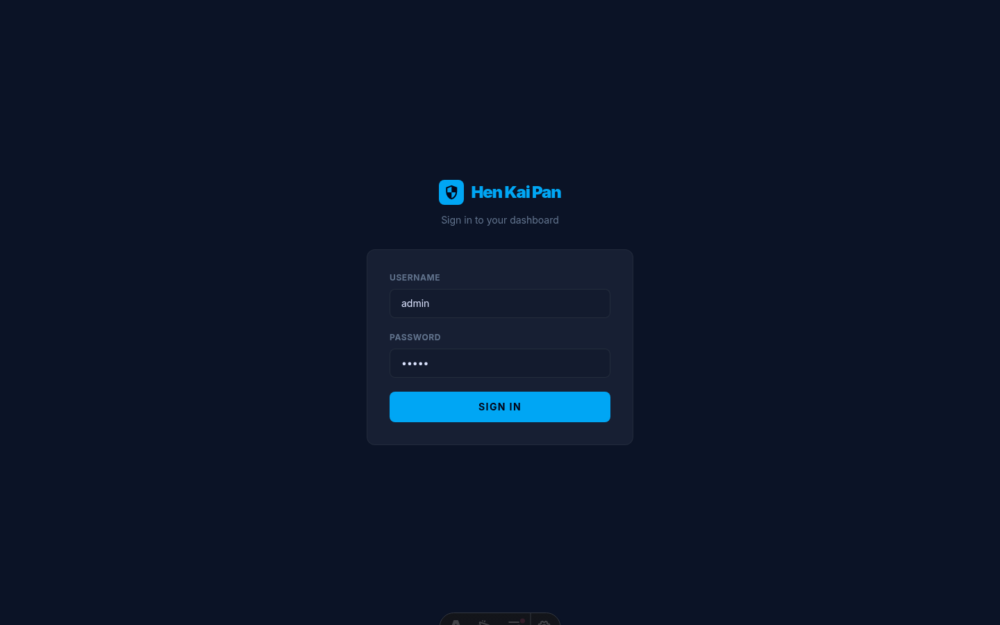
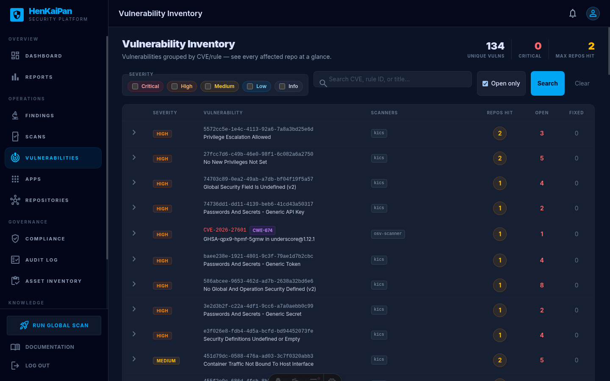
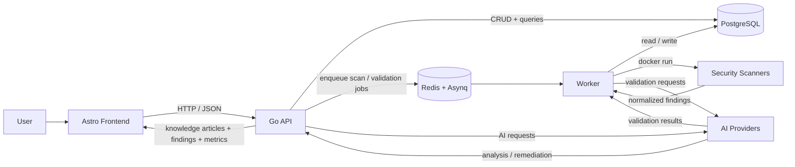
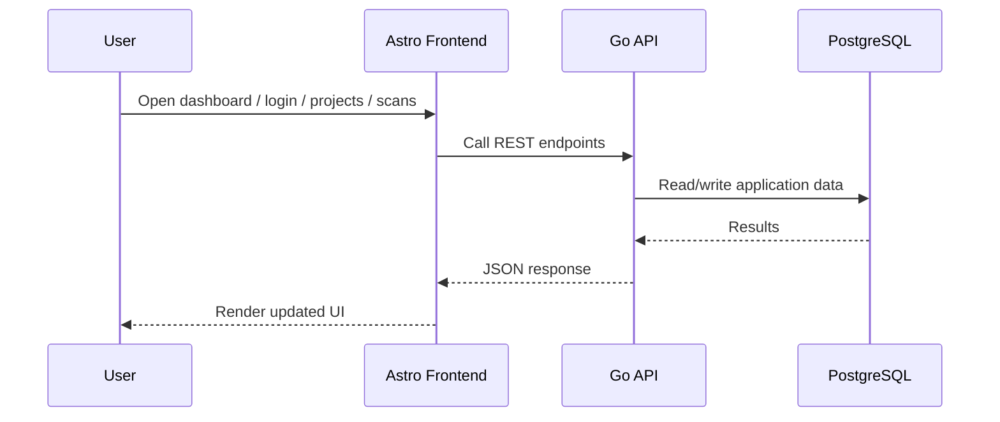
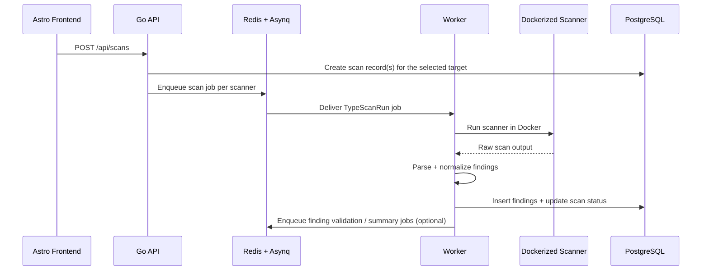

# HenKaiPan



HenKaiPan is an ASPM platform for security scans, findings, knowledge articles, policy automation, and AI-assisted remediation.

## Screenshots

### Landing



### Dashboard


### Vulns



## Product Model

- **App** = optional business grouping
- **Project** = primary technical unit that users create, connect, scan, and review
- **Standalone projects** are allowed (`project.app_id = NULL`)
- **Repository connections** live directly on projects (`repo_url`, `github_token_encrypted`)

## Platform Features

1. **Dashboard** — health metrics, onboarding wizard, and recent activity
2. **Scans** — scanner status, logs, results, and cron-based scan scheduling
3. **Findings** — filters, triage, SLA tracking, exports, and cross-scan deduplication
4. **Vulns** — grouped vulnerability inventory
5. **Projects** — connect repos, manage GitHub tokens, track scan history
6. **Knowledge** — remediation guides and AI-generated articles
7. **Settings** — integrations, security, policies, notifications, users, teams

## Tech Stack

- **Frontend:** Astro 6 + Tailwind v4
- **API:** Go + chi
- **Database:** PostgreSQL 17 + pgx v5
- **Background jobs:** Redis 8 + Asynq
- **Scanners:** Dockerized tools (Semgrep, Trivy, Gitleaks, Checkov, Nuclei, and more)
- **AI features:** OpenRouter and Cloudflare Workers AI for remediation generation and finding validation

## Architecture Overview

HenKaiPan is split into three main runtime layers:

- **Frontend (`/frontend`)**: renders the UI and calls the backend API.
- **API (`/cmd/api`)**: exposes REST endpoints, authenticates users, reads/writes data, and enqueues async work.
- **Worker (`/cmd/worker`)**: consumes queued jobs, runs scanners in Docker containers, parses results, stores findings, and triggers AI validation.

PostgreSQL stores the platform state, while Redis/Asynq is used as the job queue between the API and the worker.

## High-Level Architecture Diagram



## Runtime Flow

### 1. User-facing request flow



### 2. Scan execution flow



### 3. AI remediation and validation flow


## Main Components

- **Frontend** — Astro 6 + Tailwind v4; UI lives in `frontend/` and uses `frontend/src/lib/api.ts`.
- **API** — `cmd/api/main.go` handles auth, CRUD endpoints, metrics, and job enqueueing.
- **Worker** — `cmd/worker/main.go` runs queued scans, validations, summaries, webhooks, emails, and periodic tasks (scan scheduler, digest generator).
- **Scanning** — scanners are registered in `internal/scanner/registry.go` as named scanners grouped into packs (`sast`, `sca`, `secrets`, `iac`, `containers`).
- **Scheduling** — cron-based periodic scans managed by `internal/tasks/scan_scheduler.go`, configurable from the UI.
- **Deduplication** — findings deduplicated across scans via SHA256 fingerprints (`scanner:rule_id:file_path:line`) with `ON CONFLICT DO NOTHING`.
- **Digest** — weekly executive email digest (`internal/tasks/digest.go`) with severity breakdown, SLA report, and 7-day trend.
- **Data** — PostgreSQL is the source of truth; repositories live under `internal/repository`.
- **AI & integrations** — OpenRouter / Cloudflare AI, GitHub, Jira, webhooks, and notifications.
- **Onboarding** — guided wizard at `/dashboard/welcome` with 3-step flow (project → token → first scan) and first-run redirect.

### Database Schema

- PostgreSQL is the source of truth; schema changes live in `migrations/`.
- Core entities: users, teams, apps, projects, scans, findings, knowledge articles, policies, suppressions, webhooks, scan schedules, and integrations.
- Sensitive integration secrets are stored encrypted; user passwords remain hashed.

### Queue Layer

- Redis is used by Asynq for background job transport.
- Queue bootstrap lives in `internal/queue/queue.go`.
- The API enqueues work; the worker consumes it.

### AI Layer

- Multiple AI providers supported:
  - `internal/ai/openrouter.go` — OpenRouter integration
  - `internal/ai/cloudflare.go` — Cloudflare Workers AI integration
  - `internal/ai/provider.go` — Provider abstraction layer
  - `internal/ai/notification.go` — AI-powered notification summaries
- AI is used for:
  - **Remediation generation** into knowledge articles
  - **Finding validation** to estimate confidence and false-positive likelihood
  - **Finding summaries** for repeated scanner results
  - **Notification summaries** for human-readable alerts

### Integrations

- **GitHub Integration** (`internal/github/client.go`):
  - GitHub App installation per org/repo
  - Receive PR/webhook context
  - Map scans to PRs
  - Comment on PR with findings summary

- **Jira Integration** (`internal/jira/client.go`):
  - Create tickets from findings
  - Link findings to Jira issues

- **Webhook System** (`internal/webhook/dispatcher.go`):
  - Custom webhook endpoints
  - Event delivery with retries
  - Configurable events (new findings, SLA breaches, etc.)

- **Notifications**:
  - Slack webhook integration
  - Email notifications via SMTP
  - Configurable notification rules

### Findings + Knowledge Modules

- `internal/findings/validation_agent.go` — AI validation flow for findings
- `internal/findings/summary_agent.go` — AI summary generation for findings
- `internal/findings/summarymeta/metadata.go` — summary fingerprint and metadata helpers
- `internal/knowledge/articles.go` — article helpers, slug generation, and remediation article drafting

## Source Tree

```text
cmd/           # API and worker entrypoints
frontend/      # Astro app and browser API client
internal/      # Auth, handlers, repository, scanner, tasks, integrations
migrations/    # Database schema and changes
scripts/       # Demo workspace seed and utility scripts
presentation/  # Screenshots used in the README
```

## Local Development

### Prerequisites

- Go 1.26+
- Node.js 24+
- PostgreSQL 17+
- Redis 8+
- Docker (for running scanners)

### Start infrastructure only

```bash
make dev-infra
```

### Seed demo workspace (optional)

```bash
docker compose exec -T postgres psql -U aspm -d aspm < scripts/seed-demo.sql
```

Creates a sample project, scans (semgrep + trivy + gitleaks), and 9 findings with real CVE IDs for evaluation.

### Start each service in separate terminals

```bash
make dev-api
make dev-worker
make dev-frontend
```

### Start the full stack with Docker Compose

```bash
make up
```

## Environment

Copy `.env.example` to `.env` and configure the required variables. All available configuration options are documented in the `.env.example` file, including:

- **Required**: Database, JWT secret, admin credentials
- **Server**: Port, Redis configuration
- **Integrations**: GitHub, SMTP/email
- **AI**: OpenRouter and/or Cloudflare Workers AI configuration

If AI providers are not configured, AI remediation and validation features will be disabled.

## License

MIT
